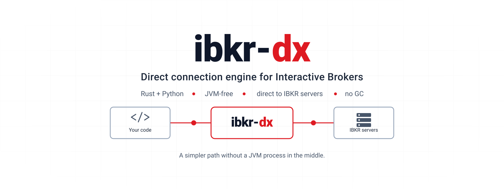
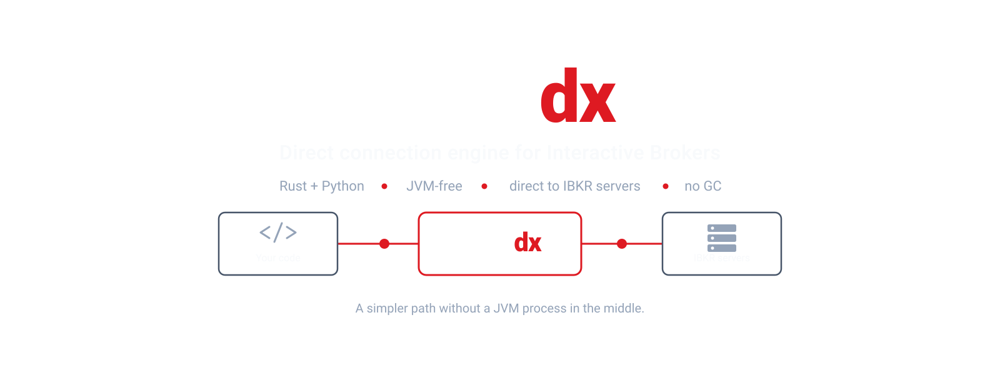

<div class="dx-hero">

<h1 class="dx-title">IBKR-DX</h1>




<p class="dx-lede">Talk directly to IBKR. The TWS API your program already uses, with no IB Gateway, no Trader Workstation and no JVM between you and the venue.</p>

<p class="dx-cta">
  <a class="dx-primary" href="./getting-started.html">Get started</a>
  <a href="./recipes/python/login.html">Python recipes</a>
  <a href="./recipes/rust/login.html">Rust recipes</a>
  <a href="https://github.com/userFRM/ibkr-dx">GitHub</a>
</p>

</div>

## One line changes

A program written against the TWS API talks to IB Gateway or Trader Workstation
over a socket on localhost, and that process talks to the venue. IBKR-DX takes
the gateway's place: it logs in, holds the trading, market-data, historical and
security-definition connections open, and gives your program the same calls and
the same callbacks.

```diff
- ib.connect("127.0.0.1", 4001, clientId=1)     # needs a gateway running
+ ib.connect(username="...", password="...")    # no external process
```

`host` and `port` are still accepted and are ignored. There is no local process
to point them at.

## What goes away

<div class="dx-cards">
<div class="dx-card">
<p class="dx-card-title">The process</p>
<p>Nothing to install, launch, log into on a schedule, or restart.</p>
</div>
<div class="dx-card">
<p class="dx-card-title">The JVM</p>
<p>No heap to size, and no garbage collector pausing the thread your ticks arrive on.</p>
</div>
<div class="dx-card">
<p class="dx-card-title">The localhost socket</p>
<p>Ticks are delivered in-process, to the thread that asked for them.</p>
</div>
<div class="dx-card">
<p class="dx-card-title">The window</p>
<p>It runs headless: in a container, over ssh, on a machine with no display.</p>
</div>
</div>

## What you get

<div class="dx-cards">
<div class="dx-card">
<p class="dx-card-title">The shape you already have</p>
<p><code>EClient</code> / <code>EWrapper</code>, with the same method names and the same callbacks, in Rust and in Python. An <a href="https://github.com/ib-api-reloaded/ib_async">ib_async</a> program runs on it unmodified through <code>ibkr_dx.ib_async.attach</code>.</p>
</div>
<div class="dx-card">
<p class="dx-card-title">One engine, two languages</p>
<p>The Python module is the Rust core through <a href="https://pyo3.rs">PyO3</a>, not a second implementation. A gate on every commit fails if either surface grows a call or a callback the other lacks.</p>
</div>
<div class="dx-card">
<p class="dx-card-title">Nothing in between</p>
<p>The engine runs on a thread of its own and can be pinned to a core. Quotes are published through a seqlock: the writer never blocks, and a reader takes a whole quote without a lock.</p>
</div>
<div class="dx-card">
<p class="dx-card-title">More than the API forwards</p>
<p>The session states things a gateway never passes on: the account's grants, the order types it will take, its algorithms, and data series with no documented call. <a href="./reference/beyond-the-api.html">See what</a>.</p>
</div>
<div class="dx-card">
<p class="dx-card-title">Honest about its limits</p>
<p>A call the protocol cannot carry says why, instead of returning as though it acted. The <a href="./reference/limits.html">limits</a> are written down, over a coverage matrix regenerated from the source on every commit.</p>
</div>
</div>

## Where to go next

<div class="dx-cards">
<a class="dx-card" href="./getting-started.html"><strong>Getting started</strong><span>Install, credentials, the surface to pick, and a program that connects.</span></a>
<a class="dx-card" href="./recipes/python/order-lifecycle.html"><strong>Place an order</strong><span>Place, modify, cancel and watch it fill, end to end.</span></a>
<a class="dx-card" href="./recipes/python/ib_async.html"><strong>Bring an ib_async program</strong><span>Point an existing program at the engine with one line.</span></a>
<a class="dx-card" href="./api/python.html"><strong>Look a call up</strong><span>The generated reference for every call and callback, in Python and in Rust.</span></a>
<a class="dx-card" href="./reference/limits.html"><strong>Before you depend on it</strong><span>What it will not do, and why. Then the call-by-call coverage.</span></a>
</div>

## Status

Under active development. Every capability claim in this repository is assigned
from a named artifact, a test, a script or a recorded server response, never
from reading the code. The matrix is in
[capabilities.md](https://github.com/userFRM/ibkr-dx/blob/main/docs/capabilities.md),
its counts are recomputed on every commit, and the build fails if one moves.

There is no published package yet. Both install routes build from the
repository: see [Getting started](./getting-started.md).
